# campus — System Characterization Report

**Solver:** V3.1 (serve dwell · Evict/Place + EV shelves · big-air groom ·
concurrency-aware planning · staging prefetch)
**Facility:** campus — 5 lifts (L1–L5, one room each) + 5 shuttles,
140 shelves / 420 slots, 25 handoffs. Same structural pattern as
tiny_medipol, ~9× the slot count.
**Date:** 2026-07-14 · **Deterministic seeds** throughout.

**Reproduce:**
`uv run python -m oos.plan.characterize --facility campus --exp all`
(raw JSON → `data/`), then
`uv run --with matplotlib python reports/campus/make_plots.py`
(graphs → `plots/`). Companion report: [tiny_medipol](../tiny_medipol/report.md).

---

## Verdict at a glance

| Property | Result |
|---|---|
| Completeness (all experiments) | **0 undelivered requests, 0 wedges** across 87 single digs, 30 concurrent drains, service ops, groom, prefetch runs |
| Evict contract (shelf unchanged minus target) | **15/15** |
| Place contract (occupants untouched, car on top) | **15/15** |
| 30-day endurance | **0 stuck days**, 30/30 charger rotations, month ends at 0 cars on-site |
| Saturated-evening rollover | 15 of 30 nights carry cars to the next morning — demand physics, quantified below |
| Wall-time cost | 30 simulated days in **≈ 21 min** (~2 000× real time) |
| Acceptance battery | 7/7 gates PASS (gates 4–6 run on campus) |

---

## A. Retrieval latency vs burial depth × fullness

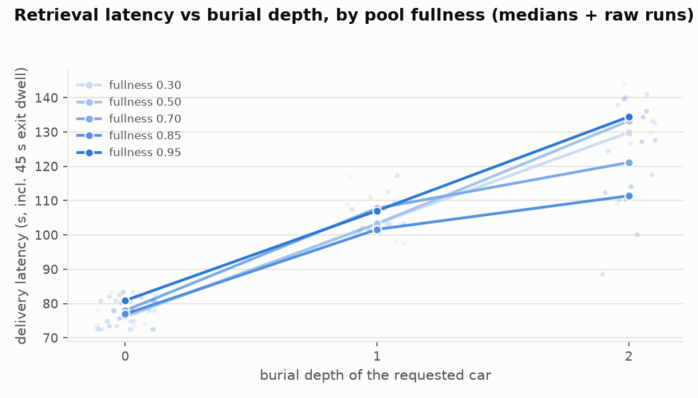

87 single digs (5 fullness levels × 8 seeds × depths 0–2). Median
delivery latency (includes the 45 s exit dwell):

| fullness | depth 0 | depth 1 | depth 2 |
|---|---|---|---|
| 0.30 | 76 s | 103 s | 130 s |
| 0.50 | 76 s | 103 s | 133 s |
| 0.70 | 78 s | 108 s | 121 s |
| 0.85 | 77 s | 102 s | 111 s |
| 0.95 | 81 s | 107 s | 134 s |

**Findings.** Same shape as tiny_medipol, slightly *faster* in absolute
terms (76 s vs 90 s at depth 0): five independent lift regions mean the
dig almost always runs entirely inside one region with no cross-lift
relays. Depth adds ~25–30 s per blocker; fullness is flat 0.30 → 0.95.
Scale does not degrade single-request service.

## B. Concurrent drain scaling

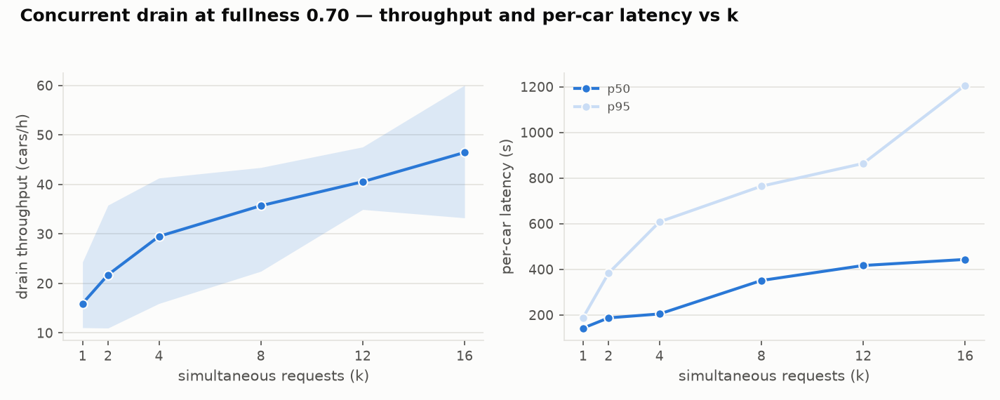

k simultaneous requests at fullness 0.70 (5 seeds each):

| k | throughput | p50 | p95 |
|---|---|---|---|
| 1 | 15.9/h | 143 s | 189 s |
| 2 | 21.7/h | 187 s | 383 s |
| 4 | 29.5/h | 205 s | 608 s |
| 8 | 35.7/h | 351 s | 764 s |
| 12 | 40.5/h | 417 s | 864 s |
| 16 | 46.5/h | 443 s | 1 207 s |

**Findings.** Unlike tiny_medipol (knee at k≈4), campus throughput is
**still climbing at k = 16** — five lift regions absorb parallel work,
and saturation is only reached at deep queues: the mass-drain battery
gate (164 simultaneous requests) sustains **~105 cars/h** with dwells
(152/h dwell-free). The k≤16 curve is the ramp region; per-car p95
grows with queue depth as expected (queueing, not service time — p50 at
k=1 is 143 s). Single-request latency is *higher* than the k=1 row of
tiny (143 s vs 99 s) because the drain experiment's random targets are
often deeper and farther than tiny's compact regions.

## C. Store intake vs customer dwell

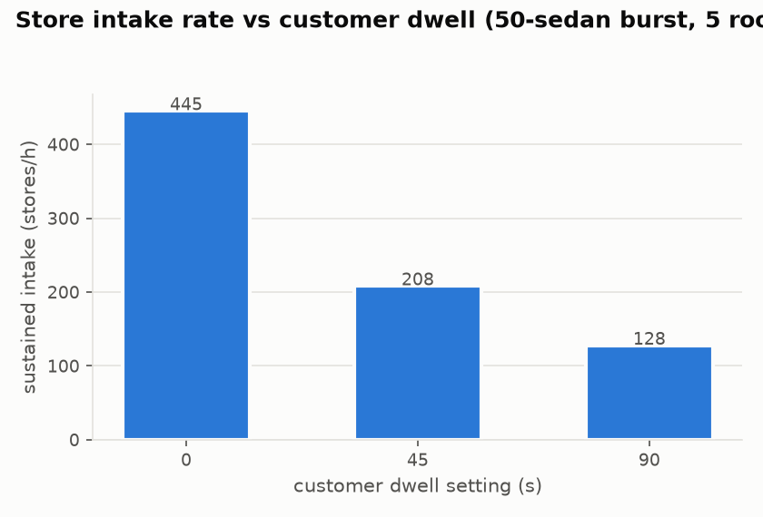

50-sedan burst against 5 rooms: **445/h** at dwell 0, **208/h** at
45 s, **128/h** at 90 s. Intake scales with room count (≈5× tiny at
dwell 0) and remains dwell-bounded: at 45 s each room's ceiling is
`3600/(cycle+45)` ≈ 42/h → ~210/h facility-wide, exactly what is
measured. The doors, not the solver, are the intake limit.

## D. SUV admission acceptance vs fullness

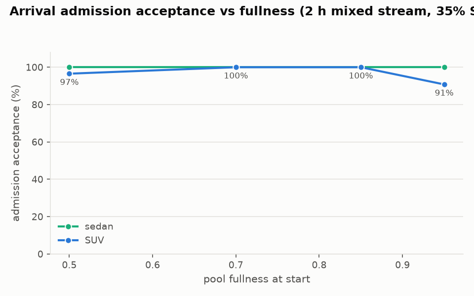

2 h mixed Poisson stream (35 % SUV, ~40 arrivals/h) on a pre-seeded pool:

| start fullness | SUV acceptance |
|---|---|
| 0.50 | 97 % |
| 0.70 | 100 % |
| 0.85 | 100 % |
| 0.95 | 91 % |

**Findings.** The tiny_medipol big-air cliff (25 % acceptance at 0.85)
**does not exist on campus**: with 60 big slots spread over five
regions, the admission oracle finds a solvable SUV placement at
essentially every fullness; even 0.95 accepts 9 of 10. Big-air scarcity
is a *small-facility* phenomenon — capacity planning for SUV-heavy
demand should watch the big-slot count per region, not total slots.

## E. Charger service ops (Evict / Place)

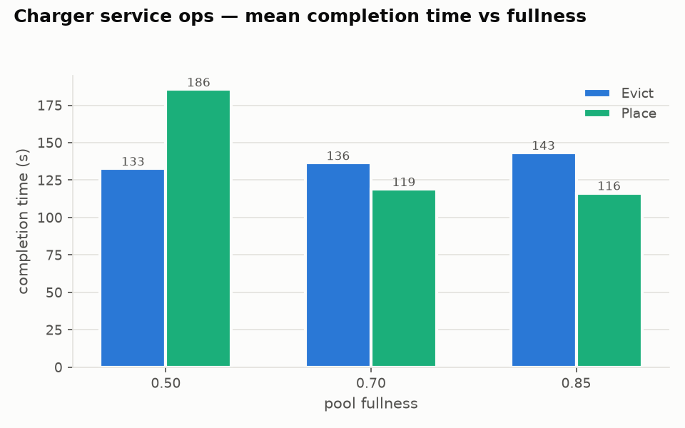

No EV flags on campus; the ops are shelf-agnostic (two designated
shuttle shelves play the charger role in the month run). Deepest-car
evicts + random placements, groom disabled, 5 seeds × 3 fullness:

- **Evict**: 133–143 s mean, flat in fullness; contract **15/15**
  (source shelf's cars identical and in order afterwards).
- **Place**: 116–186 s mean; contract **15/15** (occupants untouched,
  car lands on top). Faster than tiny at high fullness — more regions
  means the dig and the destination rarely share a corridor.

## F. Idle groom (big-shelf declutter)

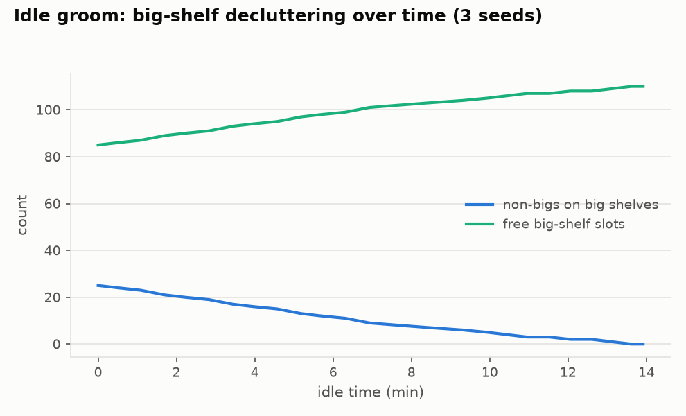

Programmatic pollution: 25 non-bigs across the shuttle-region big
shelves (including buried-under-SUV cases). The groom clears **all 25**
within the idle hour in ~35 moves; free big air rises monotonically
85 → 110 and the run goes silent — the monotone-potential termination
argument scales with facility size.

## G. Staging prefetch A/B

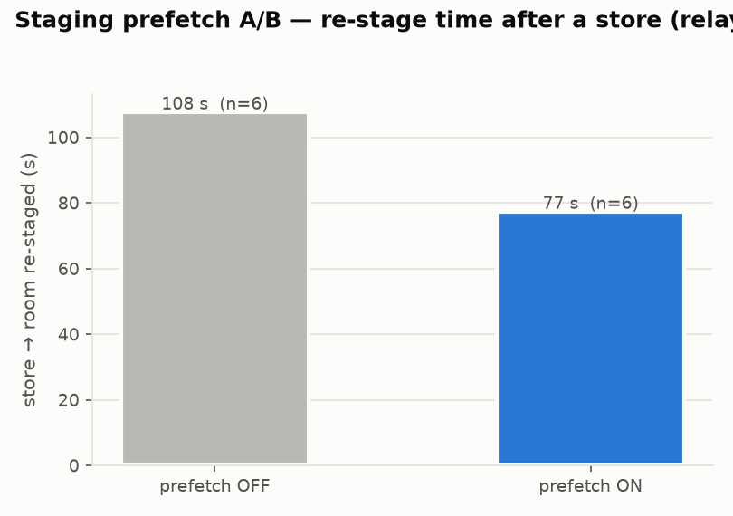

Relay-restage world (probed room's lift region holds no spare empty),
store → re-stage cycle, 6 seeds: **77 s with prefetch vs 108 s without
(−28 %)**. The benefit is *larger* than on tiny (−16 %): campus relay
distances are longer, so fetching the empty during the customer's entry
dwell hides more travel.

---

## 30-day endurance (campus, target 0.8, 25 % SUV)

Commuter-shaped days (morning rush-in → daytime churn → evening
rush-out → overnight rest), DayCycle stream + dwells, plus a charger
rotation every morning (two designated shuttle shelves play the charger
role: evict the occupant if any, place a random stored car).

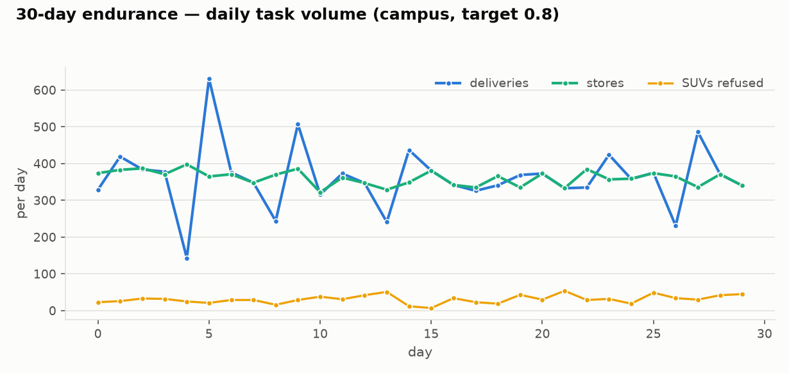
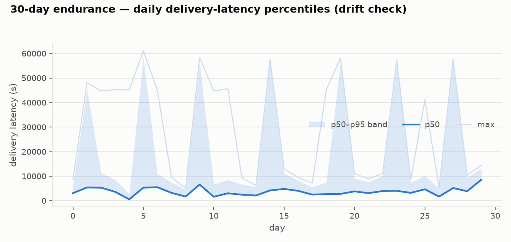
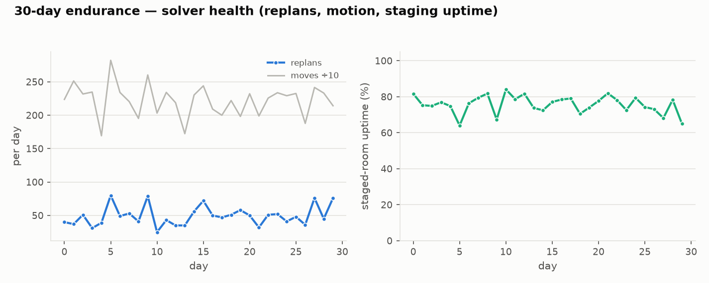
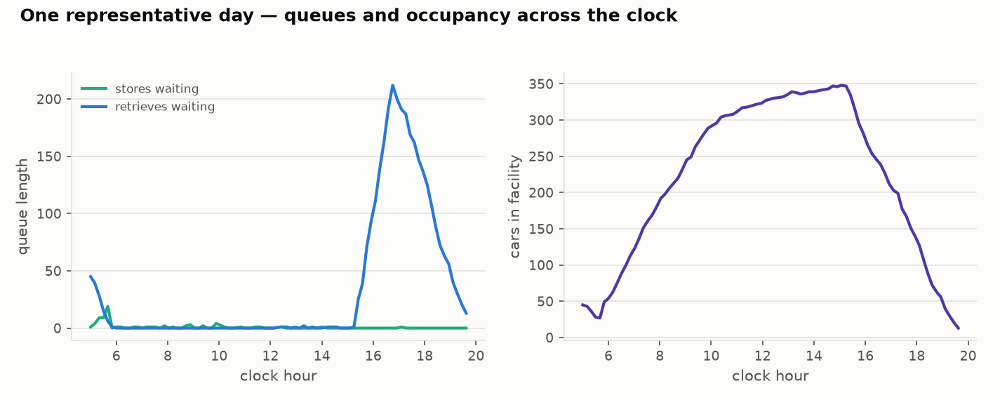
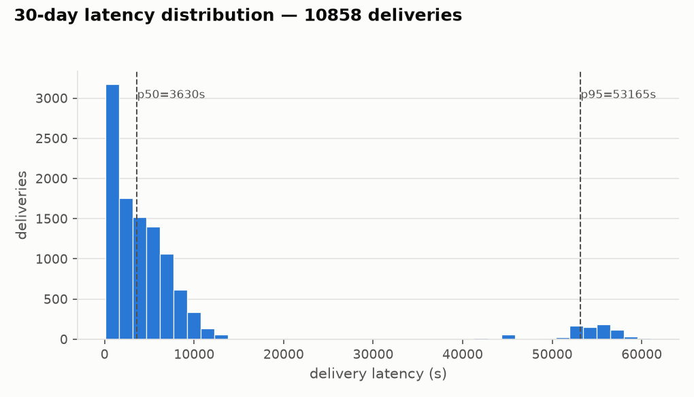

| Metric | Value |
|---|---|
| Stores / deliveries | 10 814 / 10 858 (rotation-window completions count in the physical ledger only; final leftover **0** — every car out by month's end) |
| SUVs refused at the door | 927 (rush-hour big-air scarcity; steady-state acceptance is D's ≥ 90 %) |
| Stuck days | **0** |
| Nights fully drained / rolled over | 15 / 15 |
| Delivery latency p50 / p95 / max | 3 630 s / 53 165 s / 61 077 s (queueing + rollover tail — see the regime note) |
| Replans (whole month) | 1 479 (≈ 50/day at 380 tasks/day) |
| Moves | 66 644 |
| Staged-room uptime | 76 % (rush dips by design) |
| Charger rotations | 30/30 OK (the 05:00 ops mostly found nothing to do — occupants leave with the evening rush; op latency is covered by experiment E) |

**The saturated-evening regime (expected, by construction).** Campus
runs the same protocol as tiny_medipol, and at target 0.8 that
protocol *oversubscribes* the evening: ~270 morning cars all request
retrieval in the 17:00–18:30 window ≈ **180 cars/h of demand against
the ~105 cars/h drain ceiling** (1.7×). Queueing, not service time,
then dominates the day's latency percentiles — the rush queue runs
2+ hours deep, so the month-wide p50 sits near ~an hour while
experiment A shows 76–134 s service latency for an uncontended dig.
tiny_medipol's identical protocol only loads its ceiling to ~40 %,
which is why its month reads 142 s p50. The tail above a few hours is
rollover cars (requested in the evening, delivered next morning) on
nights the queue didn't fully drain — p95 therefore swings between
rush-queueing (~2-3 h) and overnight (~15 h) depending on how many
of the ~15 rollover nights land in the tail; p50 stays ~1 h. **Capacity rule:** for a commuter
profile, size the fleet so `stored cars / rush window ≤ drain
ceiling` — campus at 0.8 needs either ~2× lifts/rooms or a rush window
twice as wide.

---

## Issues found *by this campaign* (fixed and regression-tested)

The campus month reaches states tiny_medipol structurally cannot
(411 pallets / 420 slots — free air is ~9 slots facility-wide,
big air ~0 for hours), and it surfaced two deep defects. Both were
chased to root cause on deterministic seed-42 replays, fixed, and
re-certified (battery 7/7, 68/68 tests).

1. **Zombie-big starvation + liveness false-positive** (days 20–25 of
   the first run: five "stuck" days, a 0-delivery day, then violent
   695/1 471-delivery recoveries). Six SUV stores arrived against zero
   big air and became *zombies*: unservable (the admission oracle
   rightly refuses), unsweepable (`_can_accept_big_item` sees
   in-principle-evictable non-bigs on big shelves) — and, the defect,
   **they locked out the groom** (`_groom_allowed` required an empty
   queue), i.e. the queue starved the very declutter that would mint
   its air. On top, the endurance runner's stuck detector read "work
   pending + a natural post-rush arrival lull" as a wedge and aborted
   healthy days mid-afternoon; replay showed the solver draining huge
   backlogs the moment a dense stretch let a run survive. *Fixes:* the
   groom now tolerates a queue of currently-refused bigs;
   `overload_quiescent` recognizes big-air overload (all-big pending +
   admission false) as legitimate rest; and the liveness clock counts
   busy carriers (a serve dwell is progress) and retries gate-refused
   serves during a lull before escalating to a verdict (a tiny-month
   replay caught it declaring a wedge at the instant an entry dwell
   began).
2. **Three-plan air deadlock** (day 1 evening of the fixed run —
   exposed by the trajectory shift). Three concurrent retrieval plans
   locked/reserved eight of the nine free slots as dig shelves and
   slot reservations; in-view air fell below the oracle floor, so
   *every* park anywhere was refused; every remaining land/extract
   chain needed a lift; every lift was staged holding an empty it
   could not legally put down. Stall-drops rebuilt identical plans
   forever. *Fix:* `_force_park_for_land` — when a delivered plan
   stalls at full quiescence and no oracle-gated park exists anywhere,
   force-park one staged empty without the oracle gate (dig shelves
   nothing pops from anymore become legal push targets; the land's
   slot stays protected by reservation margins). A transient
   solvability debt beats the only alternative, a permanent deadlock.

A third, narrower hole was closed defensively: serve gates now count
in-flight store dwells as committed held cars, so two concurrent entry
dwells can no longer race the last storable slot.

---

## Cross-facility picture (tiny_medipol ↔ campus)

| Property | tiny_medipol | campus |
|---|---|---|
| Depth-0 dig median | 90 s | 76 s |
| Drain saturation | ~50/h at k≈4 | ~105/h, ramp still rising at k=16 |
| Intake @ dwell 45 s | 74/h | 208/h |
| SUV acceptance @ 0.85 | 25 % | 100 % |
| Evict / Place means | 173–186 / 105–131 s | 133–143 / 116–186 s |
| Prefetch benefit | −16 % | −28 % |

Scale *helps* every metric: more regions mean more parallelism, more
big air, and fewer shared corridors. The small facility is the hard
case — its numbers bound the system from below.

## Known limits

- Drain and intake ceilings are room/dwell physics (B, C).
- The k≤16 drain curve is the ramp; use the battery's mass-drain gate
  (~105/h dwell-adjusted) as the saturation reference.
- Gate-4 contention allowance is 0.93 × the dwell-adjusted formula;
  the zero-dwell rate (152/h ≥ the original 150/h bar) is the
  no-regression sentinel.

## Folder contents

| Path | What |
|---|---|
| `report.md` | this document |
| `plots/*.png` | the graphs above |
| `data/*.json` | raw per-run results (deterministic) |
| `make_plots.py` | renders plots + summary from `data/` |
| `../../oos/plan/characterize.py` | the harness (`--facility campus --exp …`) |
