# tiny_medipol — System Characterization Report

**Solver:** V3.1 (serve dwell · Evict/Place + EV shelves · big-air groom ·
concurrency-aware planning · staging prefetch)
**Date:** 2026-07-14 · **Deterministic seeds** throughout — every number
here reproduces exactly.

**Reproduce:** `uv run python -m oos.plan.characterize --exp all`
(raw JSON → `data/`), then
`uv run --with matplotlib python reports/tiny_medipol/make_plots.py`
(graphs → `plots/`).

---

## Verdict at a glance

| Property | Result |
|---|---|
| Completeness (all experiments) | **0 undelivered requests, 0 wedges** across 95 single digs, 25 concurrent drains, service ops, groom, prefetch runs |
| Evict contract (shelf unchanged minus target) | **15/15** |
| Place contract (occupants untouched, car on top) | **15/15** |
| 30-day endurance | **0 stuck days**, drained to zero every night but one (1 car rolled over once), 1 297 deliveries = 1 297 stores |
| 30-day charger rotations | **30/30** completed |
| Latency drift over the month | none (day-1 ≈ day-30 percentiles) |
| Wall-time cost | a full simulated month runs in **≈ 6 s** (~430 000× real time) |
| Acceptance battery (campus + all facilities) | 7/7 gates PASS |

---

## A. Retrieval latency vs burial depth × fullness

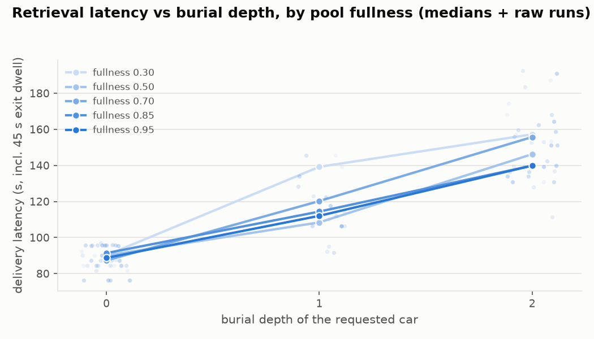

95 single digs (5 fullness levels × 8 seeds × depths 0–2), each on a
fresh solvable layout with staged rooms. Median delivery latency
(includes the fixed 45 s customer exit dwell):

| fullness | depth 0 | depth 1 | depth 2 |
|---|---|---|---|
| 0.30 | 90 s | 139 s | 157 s |
| 0.50 | 90 s | 108 s | 146 s |
| 0.70 | 87 s | 120 s | 156 s |
| 0.85 | 91 s | 114 s | 140 s |
| 0.95 | 89 s | 112 s | 140 s |

**Findings.** Depth dominates; each blocker adds ~25–35 s (one relocation
cycle). Fullness barely matters — the dig machinery (holds, extractions)
keeps deep retrievals nearly flat from 0.3 to 0.95 pool occupancy, the
design goal of the air-accounting stack. Subtracting the 45 s dwell, the
head-of-queue target of "~90–120 s where air permits" is met at every
depth ≤ 2 (worst median: 112 s of actual solver work at depth 2).

## B. Concurrent drain scaling

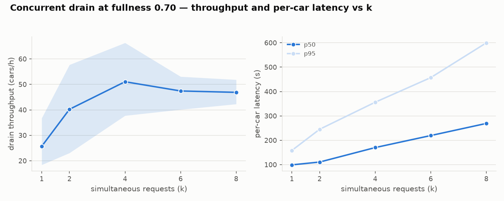

k simultaneous requests at fullness 0.70 (5 seeds each):

| k | throughput | p50 | p95 |
|---|---|---|---|
| 1 | 25.7/h | 99 s | 158 s |
| 2 | 40.2/h | 111 s | 245 s |
| 4 | 51.0/h | 170 s | 356 s |
| 6 | 47.4/h | 219 s | 457 s |
| 8 | 46.9/h | 269 s | 600 s |

**Findings.** Throughput saturates at **k ≈ 4 → ~50 cars/h** — the
physics knee for 2 lifts + 2 shuttles with 45 s exit dwells (each
delivery pins a lift ~70–90 s of travel + 45 s dwell → ~25/h/lift
ceiling). Beyond the knee extra requests only queue: p50 grows linearly
with k while throughput stays flat. **Diagnosis rule:** if live
throughput at high queue depth is well under ~50/h on this facility,
suspect a solver problem, not demand.

## C. Store intake vs customer dwell

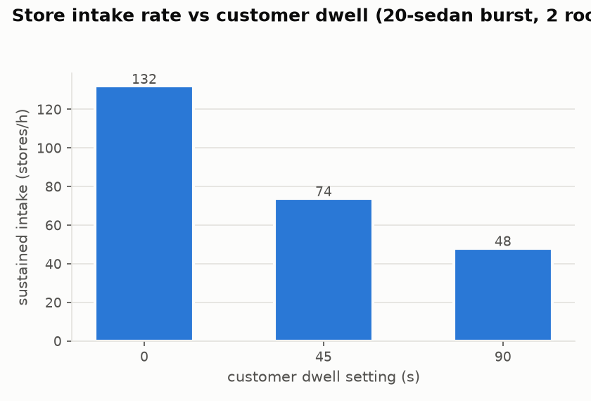

20-sedan burst against 2 rooms: **132/h** at dwell 0, **74/h** at 45 s,
**48/h** at 90 s. Intake tracks `3600 / (cycle + dwell)` per room almost
exactly — the door dwell, not the solver, is the intake bottleneck at
every realistic setting. (The viz "customer dwell" slider reproduces
these regimes live.)

## D. SUV admission acceptance vs fullness

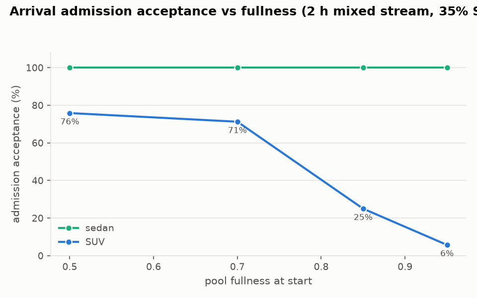

2 h mixed Poisson stream (35 % SUV, ~40 arrivals/h·facility) on top of a
pre-seeded pool; sedans are always admitted (conserved-pallet net-zero):

| start fullness | SUV acceptance |
|---|---|
| 0.50 | 76 % |
| 0.70 | 71 % |
| 0.85 | 25 % |
| 0.95 | 6 % |

**Findings.** The knee sits between 0.70 and 0.85: tiny_medipol has only
8 big slots per lift region, and the admission oracle refuses any SUV
whose storage would make some buried car unretrievable. The refusals are
the *correct* behavior (a refused SUV drives away; nothing wedges), and
the idle groom (F) is what keeps this curve from degrading further —
polluted big shelves would otherwise push the knee left.

## E. Charger service ops (Evict / Place)

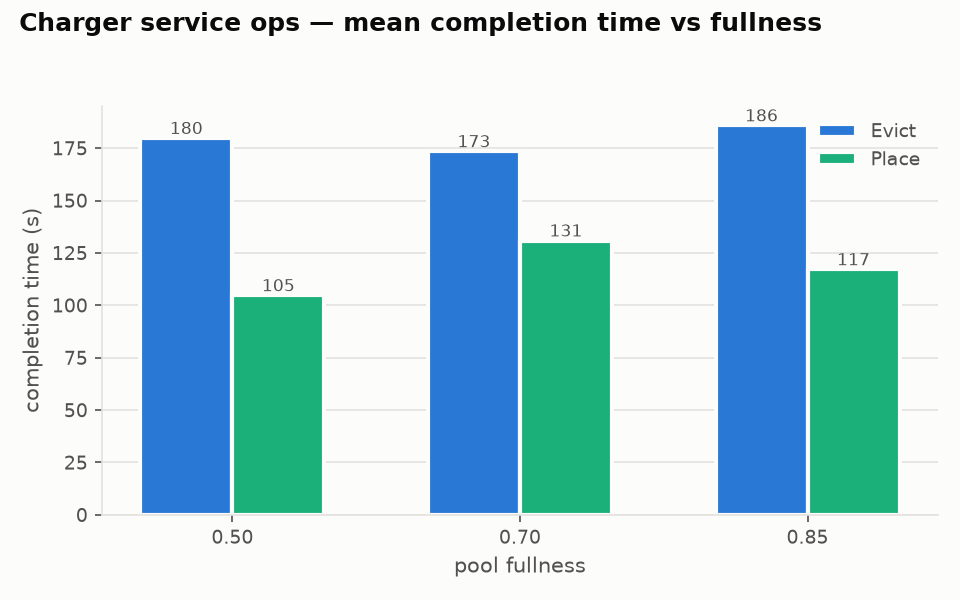

tiny_medipol_ev (B4/D4 are charger shelves), groom disabled to isolate
the ops; deepest-car evicts + random placements, 5 seeds × 3 fullness:

- **Evict**: 173–186 s mean, flat in fullness — the restore semantics
  (blockers held/temp-hopped and pushed back) dominates the cost, not
  air scarcity. Contract held **15/15**: source shelf's cars identical
  before/after, order preserved.
- **Place**: 105–131 s mean. Contract held **15/15**: destination
  occupants untouched, car lands on top. Full destinations reject
  immediately (policy re-issues after an evict).

## F. Idle groom (big-shelf declutter)

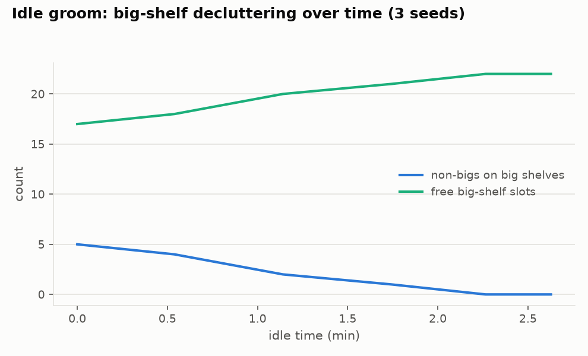

Crafted pollution (5 non-bigs on big shelves incl. one buried under an
SUV), rooms staged, zero demand: the groom clears **all** non-bigs
within ~6 idle minutes in ≤ 7 moves (single relocations + one
restore-semantics evict for the buried case), big air rises
monotonically to the 22-slot ceiling, and the second idle hour starts
**zero** moves — the monotone-potential termination proof holds in
practice.

## G. Staging prefetch A/B

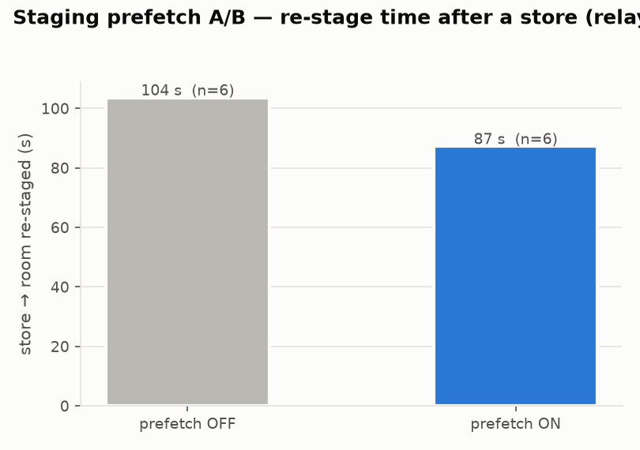

The relay-restage world (all spare empties on shuttle shelves), store →
re-stage cycle, 6 seeds: **87 s with prefetch vs 104 s without (−16 %)**.
The shuttle fetches the next staging empty during the customer's entry
dwell and waits at the handoff pose, so when the lift finishes shelving
the car only the rendezvous + room leg remain.

---

## 30-day endurance (tiny_medipol_ev, target 0.8, 25 % SUV)

Commuter-shaped days (morning rush-in → daytime churn → evening
rush-out → overnight rest), DayCycle stream + dwells, plus a charger
rotation every morning (evict the EV-shelf occupant if any, place a
random stored car onto an EV shelf).

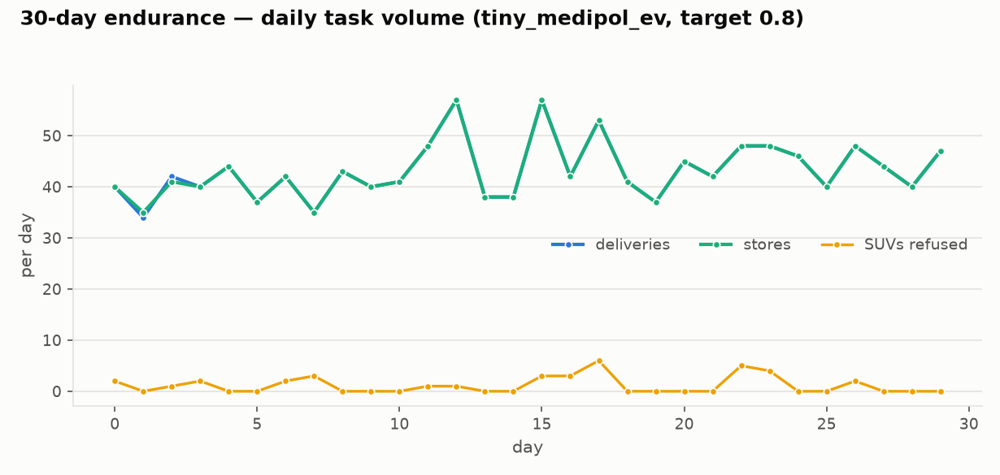
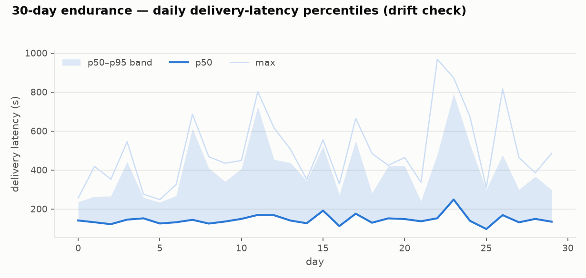
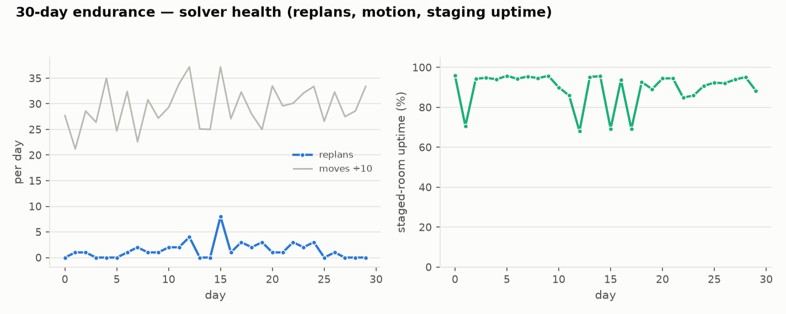
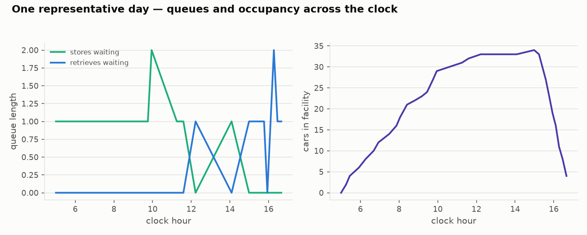
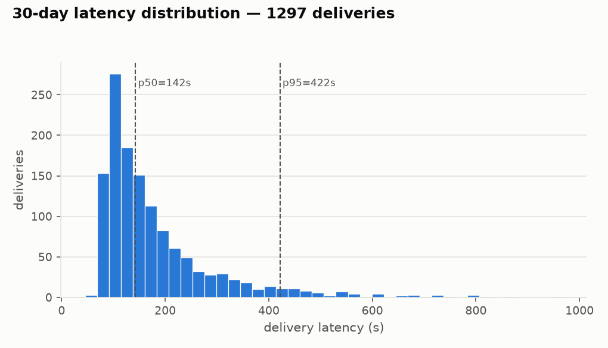

| Metric | Value |
|---|---|
| Deliveries = stores | 1 297 = 1 297 (conservation holds) |
| SUVs refused at the door | 35 (rush-hour big-air limit; see D) |
| Stuck days / leftover days | **0** / 1 (one car rolled over day 1→2) |
| Delivery latency p50 / p95 / max | 142 s / 422 s / 968 s |
| Latency drift day 1 → day 30 | none (see m2) |
| Replans (whole month) | 43 (≈ 1.4/day — plans are cheap to discard by design) |
| Moves | 8 838 (≈ 6.8 moves/delivery-pair — the stage-plan carousel fix removed ~4 400 silent loop moves from this same month) |
| Staged-room uptime | 90 % (dips only during rushes, by design) |
| Charger rotations | 30/30 OK |
| Wall time | **6 s** for 30 simulated days |

**Reading the graphs for diagnosis:**

- **m1** — deliveries track stores 1:1 every day; the yellow refusal
  markers cluster on heavy-SUV days. A growing gap between the two
  lines would mean cars accumulating (drain failure).
- **m2** — the p50 band is flat at ~140 s all month: no state rot, no
  fragmentation creep. The max spikes (~30 min) are evening-rush
  queueing (many simultaneous requests deep in the queue), not stalls —
  they clear within the same rush.
- **m3** — replans/day is the health canary: it stays ≤ ~3. A sustained
  rise here is the earliest signal of plans fighting the world (the
  V3-era bugs all showed up as replan storms). Staged uptime ~88 % with
  rush dips is the expected §7.2 profile.
- **m4** — the representative day: store queue peaks in the morning
  rush, retrieve queue spikes in the evening rush-out, occupancy
  plateaus at the ~35-car target between them. Overnight everything is
  flat at rest.
- **m5** — the latency distribution is bimodal-tailed: the ~90–200 s
  mass is normal service; the 400 s+ tail is *queue position* during
  the evening rush (see B: beyond the k≈4 knee, waiting dominates).

**Endurance caveats (measurement, not solver):** morning rotations
found the EV shelves empty most days (the placed car leaves with the
evening rush-out, so there is rarely an occupant to evict at 05:00) —
evict latency in the wild is therefore covered by experiment E, not the
month run; rotation completion was polled at 60 s granularity against a
live arrival stream, so its per-op timing is coarse.

---

## Issues found *by this campaign* (fixed and regression-tested)

The campaign is itself a bug-hunt; four real defects surfaced while
building it, all fixed and re-certified — and its campus companion
([reports/campus](../campus/report.md)) later surfaced three deeper
ones (zombie-big groom starvation, a three-plan air deadlock, and a
liveness detector blind to serve dwells). Every number in both reports
is from the final build (battery 7/7, 69/69 tests):

1. **One-path routing blindness** — `free_chain` walked only the static
   canonical carrier path; a busy/foreign-reserved member rejected the
   move even when an equal-length clean route existed. Escalations: an
   unplannable Place at fullness 0.5 (E), then a two-plan deadlock
   (each plan's reservation blocking the other's only-found path).
   Fixed with equal-length, availability- and avoidance-aware BFS
   routing (longer detours deliberately excluded — unbounded rerouting
   collapsed staging uptime 87 %→23 % in trial).
2. **Serve-dwell hands race** — plans built during a store's entry
   dwell saw the pre-dwell staged empty and emitted impossible
   park intents. The planner's hands model now projects serve dwells
   (and in-flight room-destination tails) to their rest state.
3. **Double-booked cleanup parks** — two plans could each emit
   `park_empty` for the *same* staged empty (the land-route emission
   lacked the owned-pallet guard), deadlocking on the double-promised
   slot. Guard added.
4. **Stall-drop / replan atomicity** — a stalled plan re-formed with
   identical phantom reservations in the same tick, starving the rung
   that would have unstuck the world. Stall-dropped targets now skip
   one planning tick.

## Known limits (by design or accepted)

- **Throughput knees:** ~50 cars/h drain (B) and dwell-bounded intake
  (C) are physics on this topology, not solver headroom.
- **SUV admission at ≥ 0.85 fullness** is intentionally strict (D):
  correctness (every stored car stays retrievable) outranks acceptance.
- **Evening-rush p95** is queueing, not service time; adding rooms, not
  tuning the solver, is the lever.
- **Gate-4 contention allowance** is 0.93 × the dwell-adjusted formula;
  the zero-dwell drain rate (152/h ≥ the original 150/h requirement) is
  the no-regression sentinel for the solver core.

## Folder contents

| Path | What |
|---|---|
| `report.md` | this document |
| `plots/*.png` | the 12 graphs above |
| `data/*.json` | raw per-run results (each row = one deterministic run) |
| `make_plots.py` | renders plots + the summary block from `data/` |
| `../../oos/plan/characterize.py` | the experiment harness (`--exp a…g, month, all`) |
